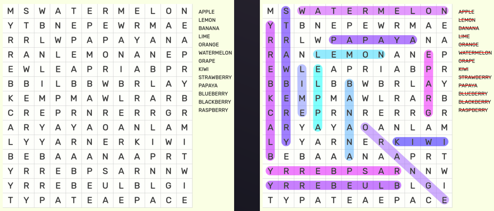
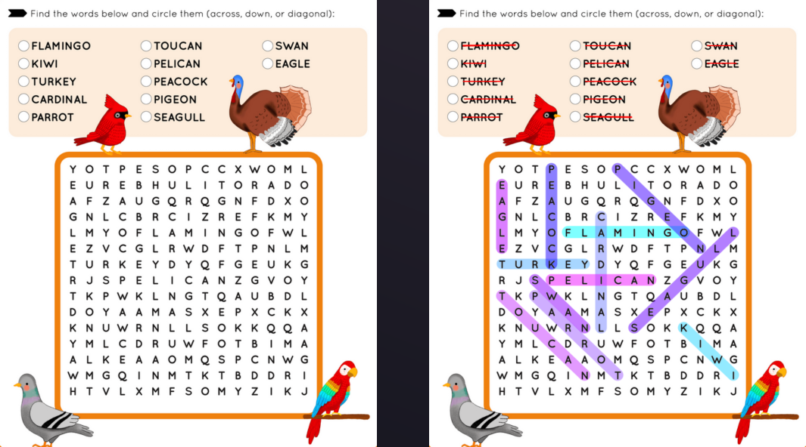
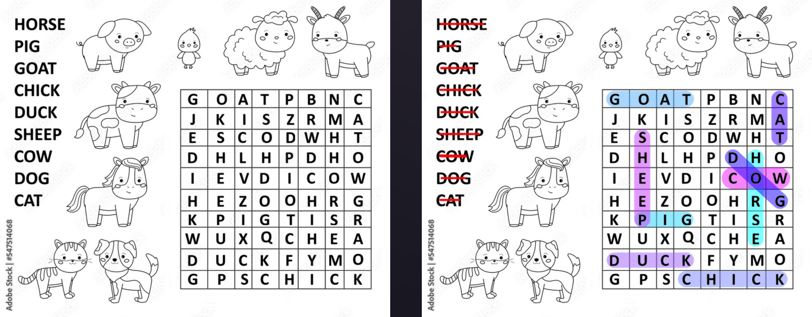
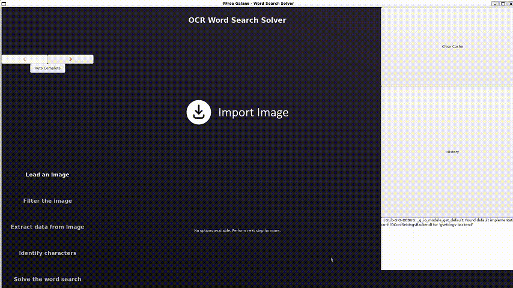

# S3_Project_OCR: #FreeGalane

Application in C done as a project of the S3 EPITA semester. 
Inputs a word search game as an image, solves it,
and returns the solution graphically on a reconstruction.

# Application Guide

### Launch the Application
1. Run "make" (or "make all") to compile the application.
2. Launch with "./main".

### Key Sections
1. Display Section (left side):
    Shows the results of each solving step.
2. Control Pannel (top left):
    1. **Auto Complete**: Completes all steps instantly.
    2. **Next** (the Left Arrow button): Performs next step.
    3. **Previous** (the Right Arrow button): Shows previous step without resetting any progress.
    4. **Save Step**: Save current step ouput (eg. image, text files..).
    5. **Modify/Edit** (image, text, data): Allows modifications of the current step before the next processing.
3. History (left):
    Lists every processed step.

### How to use
1. Import an image:
    - Click the import button or **Next**.
    - Click **Auto Complete** (note: input image will not be modifiable).
2. Advance steps:
    - Click **Next** (Left Arrow button).
    - Click **Auto Complete** for all steps.
3. Save output (eg. final result):
    - Click **Save Step**.
4. Review previous steps:
    1. Click **Previous** (Right Arrow button).
    2. Modify from a previous step to re-run the process on new input.

# Visuals

## Input/Output comparisons

### Image LEVEL 1
* Basic grid
* Normal orientation
* No other elements
* Clear colours
* Word list on the right of the grid

### Image LEVEL 3
* Complex grid
* Word list on multiple columns and lines
* Other big FULL elements (drawings, logos, etc.)
* Other small elements (letters, sentences, instructions, sources, etc.)

### Image LEVEL 4
* Low contrast between grid and background
* Non-uniform spacing with letters in cells, grid and between other letters
* Other big EMPTY elements (drawed with outlines only)

## Full process demonstration

---

# Details

## Spacial Clustering & Grid/World List Detection Algorithm

To locate and segment the crossword puzzle (**grid**) and the hidden words (**word list**) from a raw binary image, a custom structural analysis algorithm was built entirely from scratch. Instead of relying on machine learning models, which we later use to recognize letters, the system leverages pixel topology, deterministic statistical filtering, and spatial alignment mapping.

### Algorithmic Pipeline Overview

The pipeline processes the raw image through five primary stages:
* Connected Component Labeling
* Statistical Thresholding
* Dual-Axis Alignment
* Directional Grid Verification
* Asset Segmentation

#### Connected Component Labeling (CCL) via Optimized DFS
The algorithm scans the image to isolate distinct pixel groups (letters or noise) which we're going to call clusters here.
* When an unvisited black pixel is found, a **DFS** is recursively ran to map out the entire cluster (connected component), packing it into a bounding box structure: a cluster.
* **Memory Optimization:** To keep the DFS footprint small and prevent stack overflows on high-resolution images, pixel coordinates are tracked dynamically in a localized `Pixel` linked list inside the cluster, rather than copying whole buffers.

#### Statistical Filtering & Density Thresholding
Raw images contain visual artifacts (dust that remained after filtering, borders, or large decorative titles and drawings, etc). The algorithm applies a two-tier filter to discard non-text objects:
* **Size Filtering:** It computes the `median_size` of all detected clusters. Components whose pixel counts diverge drastically from this median ($\text{threshold} = 0.9 \times \text{median}$ for a dynamic threshold) are immediately filtered out. This safely drops tiny noise specs and massive black borders/shapes. There is a flaw to this method: if there is a lot of remaining 'dust' on the image, it will skew the median and cause the algorithm to drop valid letters. To prevent this, we have an initial static threshold of 10 pixels for as no letter can be represented with less than that.
* **Density Verification:** Letters have standard typographic spacing and structural empty space. The algorithm calculates the density of each cluster:
  $$\text{Density} = \frac{\text{Active Pixels}}{\text{Width} \times \text{Height}}$$
  If a cluster has a density below $20\%$, it is rejected as a fake or broken artifact. This allows us to rule out objects that survived the size filtering but are not letters such as drawings with outlines only.

#### Dual-Axis Clustering (Horizontal & Vertical Matrices)
To reconstruct the spatial relationship of the text, a unique structural sorting method is used:
1. All valid clusters are cloned into two separate arrays: one sorted by $X$-coordinates and one by $Y$-coordinates using standard `qsort`.
2. The algorithm projects these sorted elements into dynamic rows and columns. It maps elements together if they fall within an adaptive `TOLERANCE` window (half the average width/height of the text line).
3. This creates two dedicated layout matrices: `matrixH` (optimized for reading horizontal sentences) and `matrixV` (optimized for discovering vertical columns).

---

### Core Detection Principles

The algorithm solves the complex task of separating the grid from the word list using foundational geometric truths:

#### The Dual-Direction Grid Validation Rule
The grid is fundamentally a massive matrix of uniformly distributed letters. To discover it, the engine executes `find_grid` in both directions:
1. **Horizontal First:** It searches `matrixH` for aligned rows containing at least 5 consecutive, valid clusters.
2. **Vertical First:** It searches `matrixV` for columns meeting the same criteria.
3. If a matrix is found vertically, it is flipped by transposing it so that the data structures match.

> **Handling Layout Illusions:**  
Even if a valid grid structure is found on the horizontal pass, the algorithm **always** runs the vertical pass anyway. It compares the total area ($\text{Rows} \times \text{Cols}$) of both results. Because the main crossword grid is strictly larger than the word list blocks, the pass that yields the absolute maximum layout volume is crowned the true grid. This prevents the algorithm from accidentally locking onto a highly ordered word list column or grid-worldlist illusion mix.

#### Layout Profiling for Word Lists
In a crossword puzzles, the world list can either be *beside* or *below/above* the primary grid. It is **at least** one of the two.
> If it is in diagonal, it is both to the side and below/above, so it is still detected by the algorithm.

Which means the grid is always the largest **rectangle** cluster of aligned letters, and the word list is the second largest. If the layout was marked on a whiteboard hiding the value of the letters, it would be clear to the human eye which is the grid. Likewise, it is clear to our algorithm.
* Once the grid clusters are locked and tagged with a `FLAG_GRID` bitmask, the remaining untagged clusters are isolated.
* The algorithm parses the remaining rows, measuring character spacing against average letter widths. If the spacing jumps suddenly, it marks a word boundary. This is to detect a world list split in multiple columns. Groups with fewer than 3 characters are dropped to maintain a clean file as they could be drawings or other non-letter elements.

#### Word List Refining via Cluster Profiles
A secondary pass determines the exact bounding region of the text instructions. By evaluating structural metrics, the program can instantly spot and filter out bullet points, checkboxes, or stray page decorations because their low density or extreme offsets fall outside the localized bounding constraints of the true word block.

---

### Memory & Performance Blueprint

Because this tool is intended to process high-resolution images smoothly on low-spec hardware, strict low-level memory policies are maintained:
* **Dynamic Array Scaling:** The layout matrices grow dynamically on-demand using custom geometric expansion functions.
* **Aggressive Deallocation:** To avoid memory leaks, clusters are freed the exact moment they fail a threshold rule. Temporary arrays are systematically swept from the heap right after their respective extraction stages finish.
* **Sub-Image Offloading:** The final step slices the puzzle cleanly into individual image assets. It wraps coordinates cleanly, copies the pixel data into isolated buffers, and exports them directly to disk as light, discrete `.png` files ready for downstream OCR processors.
